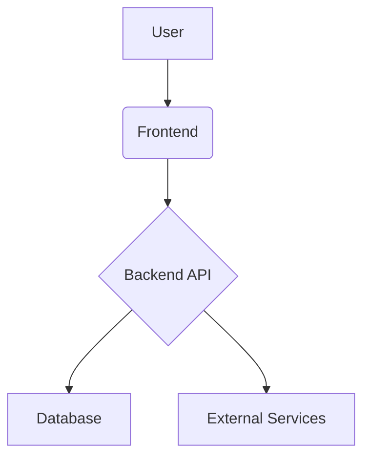

# System Architecture

> 이 문서는 프로젝트의 고수준 시스템 아키텍처를 설명합니다.

---

## 1. Architecture Diagram

- *프로젝트 구조에 맞게 다이어그램을 수정하세요.*
- *Mermaid.js 또는 이미지 파일을 사용할 수 있습니다.*

## 2. Components

### Frontend
- **Framework**: 
- **Hosting**: 
- **Description**: 

### Backend
- **Framework**: 
- **Hosting**: 
- **Description**: 

### Database
- **Service**: 
- **Description**: 

---

## 3. Data Flow

1.  **[Step 1]**:
2.  **[Step 2]**:
3.  **[Step 3]**: