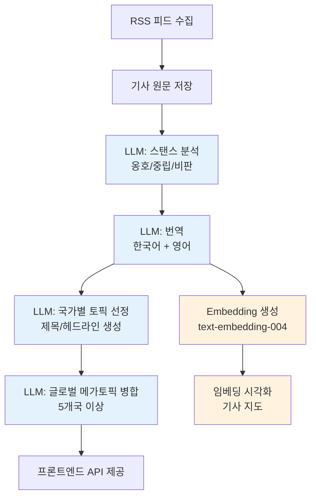

# Database Schema Design: 뉴스토스 MVP2

> **작성일**: 2025-11-28  
> **작성자**: C (Claude Code)  
> **목적**: 뉴스토스 MVP2의 Supabase PostgreSQL 스키마 설계 및 문서화

---

## 📋 설계 원칙

### 1. 네이밍 규칙
- **테이블명**: `MVP2_` 접두사 + snake_case (예: `MVP2_global_topics`)
- **컬럼명**: snake_case (예: `article_count`, `is_pinned`)
- **인덱스명**: `idx_테이블명_컬럼명` (예: `idx_MVP2_articles_published_at`)
- **외래키명**: `fk_테이블명_참조테이블명` (예: `fk_perspectives_topics`)

### 2. 데이터 무결성
- **NOT NULL**: 필수 필드는 반드시 NOT NULL 제약
- **Foreign Key**: 참조 무결성 보장 (ON DELETE CASCADE/SET NULL 명시)
- **Unique Constraint**: 중복 방지 필요 시 명시
- **Check Constraint**: 값 범위 검증 (예: stance IN ('POSITIVE', 'NEGATIVE', 'NEUTRAL'))

### 3. 성능 최적화
- **인덱스**: 자주 조회/정렬되는 컬럼에 인덱스 추가
- **JSONB**: 유연한 메타데이터는 JSONB 타입 사용
- **Timestamp**: 모든 테이블에 `created_at`, `updated_at` 포함

---

## 🗂️ 엔티티 분석 (기획서 + 파이프라인 요구사항)

### 기획서에서 추출한 핵심 엔티티

#### 1. **Global Insights** (글로벌 인사이트)
- 최근 24시간 내 5개국 이상에서 다뤄진 이슈
- Top 3 (Hero) + Rank 4~10 (List)
- 필드: `title_ko`, `intro_ko`, `article_count`, `is_pinned`, `rank`

#### 2. **Perspectives** (국가별 관점 - VS 카드)
- 각 글로벌 토픽에 대한 국가별 입장
- 필드: `country_code`, `stance` (POSITIVE/NEGATIVE/NEUTRAL), `one_liner_ko`, `source_link`

#### 3. **Local Trends** (국가별 트렌드)
- 특정 국가(MVP는 KR)의 인기 토픽
- 필드: `keyword`, `article_count`, `display_level` (1/2/3), `media_type`, `media_url`

#### 4. **Articles** (원본 기사)
- 수집된 뉴스 기사 원본 데이터
- 필드: `title`, `url`, `published_at`, `country_code`, `source_name`

#### 5. **Countries** (국가 마스터)
- 국가 코드 및 메타데이터
- 필드: `code`, `name_ko`, `name_en`, `flag_emoji`

#### 6. **Media Assets** (미디어 자산)
- AI 생성 이미지/비디오
- 필드: `url`, `type` (IMAGE/VIDEO), `alt_text`

---

### 🆕 데이터 파이프라인 요구사항 (2025-11-28 추가)

#### 7. **News Sources** (언론사 마스터) ⭐ NEW
- 각 국가별 언론사 정보 및 정치 성향 관리
- **요구사항**: 각 국가별로 보수/중립/진보 성향 당 최소 1개 이상의 언론사 선정
- 필드: `name`, `country_code`, `political_bias` (CONSERVATIVE/NEUTRAL/PROGRESSIVE), `rss_url`

#### 8. **Article Stance Analysis** (기사 스탠스 분석) ⭐ NEW
- LLM이 각 기사를 분석하여 옹호/중립/비판 시선 분류
- **파이프라인**: RSS 수집 → LLM 스탠스 분석 → 번역
- 필드: `article_id`, `stance` (SUPPORTIVE/NEUTRAL/CRITICAL), `confidence_score`

#### 9. **Topic Hierarchy** (토픽 계층 구조) ⭐ NEW
- **국가별 토픽** (Local Topics) → **글로벌 메가토픽** (Global Topics) 계층 관계
- **파이프라인**: 
  1. 영어 번역된 기사들 → LLM이 국가별 토픽 선정
  2. 영어 토픽들 → LLM이 5개국 이상 글로벌 메가토픽 선정
- 필드: `parent_topic_id` (글로벌 토픽 FK), `child_topic_ids` (국가별 토픽 배열)

#### 10. **Embeddings** (임베딩 벡터) ⭐ NEW
- **목적**: 전체 기사 지도 시각화 (폐쇄성 국가 분리, 연관 국가 군집 확인)
- **모델**: `text-embedding-004` (Google) 또는 최신 안정 버전
- **대상**: 영어 번역된 기사 + 토픽
- 필드: `embedding_vector` (VECTOR 타입), `embedding_model`, `embedding_created_at`

---

### 📊 데이터 흐름 (Data Pipeline Flow)



---

## 📊 테이블 설계 (상세)

### 1. `MVP2_countries` (국가 마스터 테이블)

**목적**: 국가 코드 및 메타데이터 관리

| 컬럼명 | 타입 | 제약 | 설명 |
|--------|------|------|------|
| `code` | VARCHAR(2) | PRIMARY KEY | ISO 3166-1 alpha-2 (예: KR, US, CN) |
| `name_ko` | VARCHAR(50) | NOT NULL | 한국어 국가명 (예: 대한민국) |
| `name_en` | VARCHAR(50) | NOT NULL | 영어 국가명 (예: South Korea) |
| `flag_emoji` | VARCHAR(10) | NOT NULL | 국기 이모지 (예: 🇰🇷) |
| `is_active` | BOOLEAN | NOT NULL DEFAULT true | 서비스 활성화 여부 |
| `created_at` | TIMESTAMPTZ | NOT NULL DEFAULT NOW() | 생성 시각 |
| `updated_at` | TIMESTAMPTZ | NOT NULL DEFAULT NOW() | 수정 시각 |

**인덱스**:
- PRIMARY KEY: `code`

**샘플 데이터**:
```sql
INSERT INTO MVP2_countries (code, name_ko, name_en, flag_emoji) VALUES
('KR', '대한민국', 'South Korea', '🇰🇷'),
('US', '미국', 'United States', '🇺🇸'),
('CN', '중국', 'China', '🇨🇳'),
('JP', '일본', 'Japan', '🇯🇵'),
('GB', '영국', 'United Kingdom', '🇬🇧');
```

---

### 2. `MVP2_global_topics` (글로벌 토픽 테이블)

**목적**: 글로벌 인사이트 메인 데이터

| 컬럼명 | 타입 | 제약 | 설명 |
|--------|------|------|------|
| `id` | UUID | PRIMARY KEY DEFAULT uuid_generate_v4() | 토픽 고유 ID |
| `title_ko` | TEXT | NOT NULL | 한국어 제목 (예: "엔비디아, 하늘 높은 줄 모르고 치솟네?") |
| `title_en` | TEXT | NOT NULL | 영어 제목 (DB 저장용) |
| `intro_ko` | TEXT | NOT NULL | 한국어 인트로 (2-3줄 요약) |
| `intro_en` | TEXT | NOT NULL | 영어 인트로 (DB 저장용) |
| `article_count` | INTEGER | NOT NULL DEFAULT 0 CHECK (article_count >= 0) | 관련 기사 수 |
| `country_count` | INTEGER | NOT NULL DEFAULT 0 CHECK (country_count >= 0) | 관련 국가 수 |
| `is_pinned` | BOOLEAN | NOT NULL DEFAULT false | 에디터 핀 여부 (Top 3 강제 진입) |
| `rank` | INTEGER | CHECK (rank > 0) | 순위 (1~10) |
| `published_at` | TIMESTAMPTZ | NOT NULL | 토픽 발행 시각 (24시간 기준) |
| `created_at` | TIMESTAMPTZ | NOT NULL DEFAULT NOW() | 생성 시각 |
| `updated_at` | TIMESTAMPTZ | NOT NULL DEFAULT NOW() | 수정 시각 |

**인덱스**:
- PRIMARY KEY: `id`
- `idx_MVP2_global_topics_rank`: `rank ASC` (정렬용)
- `idx_MVP2_global_topics_published_at`: `published_at DESC` (최신순 조회)
- `idx_MVP2_global_topics_is_pinned`: `is_pinned DESC` (핀 우선 조회)

**정렬 로직**:
```sql
-- 기획서 요구사항: is_pinned 우선 → article_count 내림차순
ORDER BY is_pinned DESC, article_count DESC, published_at DESC
```

---

### 3. `MVP2_perspectives` (국가별 관점 테이블 - VS 카드)

**목적**: 각 글로벌 토픽에 대한 국가별 입장 저장

| 컬럼명 | 타입 | 제약 | 설명 |
|--------|------|------|------|
| `id` | UUID | PRIMARY KEY DEFAULT uuid_generate_v4() | 관점 고유 ID |
| `topic_id` | UUID | NOT NULL REFERENCES MVP2_global_topics(id) ON DELETE CASCADE | 글로벌 토픽 FK |
| `country_code` | VARCHAR(2) | NOT NULL REFERENCES MVP2_countries(code) ON DELETE CASCADE | 국가 코드 FK |
| `stance` | VARCHAR(10) | NOT NULL CHECK (stance IN ('POSITIVE', 'NEGATIVE', 'NEUTRAL')) | 입장 (색상 결정) |
| `one_liner_ko` | TEXT | NOT NULL | 한국어 한 줄 요약 (구어체, 예: "AI 혁명 멈출 수 없어!") |
| `one_liner_en` | TEXT | NOT NULL | 영어 한 줄 요약 (DB 저장용) |
| `source_link` | TEXT | NOT NULL | 대표 기사 원문 링크 |
| `article_count` | INTEGER | NOT NULL DEFAULT 0 CHECK (article_count >= 0) | 해당 국가의 관련 기사 수 |
| `created_at` | TIMESTAMPTZ | NOT NULL DEFAULT NOW() | 생성 시각 |
| `updated_at` | TIMESTAMPTZ | NOT NULL DEFAULT NOW() | 수정 시각 |

**인덱스**:
- PRIMARY KEY: `id`
- UNIQUE: `(topic_id, country_code)` - 하나의 토픽에 국가당 하나의 관점만 존재
- `idx_MVP2_perspectives_topic_id`: `topic_id` (조인 최적화)
- `idx_MVP2_perspectives_stance`: `stance` (색상 필터링)

**샘플 쿼리**:
```sql
-- 특정 토픽의 모든 국가 관점 조회 (VS 카드 데이터)
SELECT 
  p.*,
  c.name_ko,
  c.flag_emoji
FROM MVP2_perspectives p
JOIN MVP2_countries c ON p.country_code = c.code
WHERE p.topic_id = 'xxx-xxx-xxx'
ORDER BY p.article_count DESC;
```

---

### 4. `MVP2_local_topics` (국가별 트렌드 테이블)

**목적**: 특정 국가의 인기 토픽 (모자이크 레이아웃)

| 컬럼명 | 타입 | 제약 | 설명 |
|--------|------|------|------|
| `id` | UUID | PRIMARY KEY DEFAULT uuid_generate_v4() | 토픽 고유 ID |
| `country_code` | VARCHAR(2) | NOT NULL REFERENCES MVP2_countries(code) ON DELETE CASCADE | 국가 코드 FK |
| `title` | TEXT | NOT NULL | 토픽 제목 (예: "손흥민 득점왕 도전") |
| `keyword` | VARCHAR(100) | NOT NULL | 핵심 키워드 (예: "손흥민") |
| `article_count` | INTEGER | NOT NULL DEFAULT 0 CHECK (article_count >= 0) | 관련 기사 수 |
| `display_level` | INTEGER | NOT NULL CHECK (display_level IN (1, 2, 3)) | 타일 크기 (1: Big, 2: Medium, 3: Small) |
| `media_type` | VARCHAR(10) | CHECK (media_type IN ('IMAGE', 'VIDEO')) | 미디어 타입 |
| `media_url` | TEXT | | 미디어 URL (AI 생성 이미지/비디오) |
| `media_alt_text` | TEXT | | 이미지 대체 텍스트 (접근성) |
| `published_at` | TIMESTAMPTZ | NOT NULL | 토픽 발행 시각 |
| `created_at` | TIMESTAMPTZ | NOT NULL DEFAULT NOW() | 생성 시각 |
| `updated_at` | TIMESTAMPTZ | NOT NULL DEFAULT NOW() | 수정 시각 |

**인덱스**:
- PRIMARY KEY: `id`
- `idx_MVP2_local_topics_country_code`: `country_code` (국가별 필터링)
- `idx_MVP2_local_topics_article_count`: `article_count DESC` (정렬용)
- `idx_MVP2_local_topics_published_at`: `published_at DESC` (최신순 조회)

**Display Level 할당 로직**:
```sql
-- 기획서 요구사항: article_count 내림차순 정렬 후 레벨 할당
-- Lv 1: 상위 1~3위 (최대 3개)
-- Lv 2: 상위 4~20%
-- Lv 3: 나머지
```

---

### 5. `MVP2_articles` (원본 기사 테이블)

**목적**: 수집된 뉴스 기사 원본 데이터 저장

| 컬럼명 | 타입 | 제약 | 설명 |
|--------|------|------|------|
| `id` | UUID | PRIMARY KEY DEFAULT uuid_generate_v4() | 기사 고유 ID |
| `url` | TEXT | NOT NULL UNIQUE | 기사 원문 URL (중복 방지) |
| `title_original` | TEXT | NOT NULL | 원문 제목 |
| `title_ko` | TEXT | | 한국어 번역 제목 (LLM 번역) |
| `title_en` | TEXT | | 영어 번역 제목 (LLM 번역, 임베딩용) ⭐ NEW |
| `summary_ko` | TEXT | | 한국어 요약 (LLM 생성) |
| `summary_en` | TEXT | | 영어 요약 (LLM 생성, 임베딩용) ⭐ NEW |
| `country_code` | VARCHAR(2) | NOT NULL REFERENCES MVP2_countries(code) ON DELETE CASCADE | 기사 출처 국가 |
| `source_id` | UUID | REFERENCES MVP2_news_sources(id) ON DELETE SET NULL | 언론사 FK ⭐ NEW |
| `source_name` | VARCHAR(100) | NOT NULL | 언론사명 (예: CNN, BBC) |
| `published_at` | TIMESTAMPTZ | NOT NULL | 기사 발행 시각 |
| `collected_at` | TIMESTAMPTZ | NOT NULL DEFAULT NOW() | 수집 시각 |
| `global_topic_id` | UUID | REFERENCES MVP2_global_topics(id) ON DELETE SET NULL | 연결된 글로벌 토픽 (nullable) |
| `local_topic_id` | UUID | REFERENCES MVP2_local_topics(id) ON DELETE SET NULL | 연결된 로컬 토픽 (nullable) |
| `created_at` | TIMESTAMPTZ | NOT NULL DEFAULT NOW() | 생성 시각 |
| `updated_at` | TIMESTAMPTZ | NOT NULL DEFAULT NOW() | 수정 시각 |

**인덱스**:
- PRIMARY KEY: `id`
- UNIQUE: `url` (중복 수집 방지)
- `idx_MVP2_articles_country_code`: `country_code` (국가별 필터링)
- `idx_MVP2_articles_source_id`: `source_id` (언론사별 필터링) ⭐ NEW
- `idx_MVP2_articles_published_at`: `published_at DESC` (최신순 조회)
- `idx_MVP2_articles_global_topic_id`: `global_topic_id` (조인 최적화)
- `idx_MVP2_articles_local_topic_id`: `local_topic_id` (조인 최적화)

---

### 6. `MVP2_media_assets` (미디어 자산 테이블)

**목적**: AI 생성 이미지/비디오 메타데이터 관리

| 컬럼명 | 타입 | 제약 | 설명 |
|--------|------|------|------|
| `id` | UUID | PRIMARY KEY DEFAULT uuid_generate_v4() | 미디어 고유 ID |
| `url` | TEXT | NOT NULL UNIQUE | 미디어 파일 URL (Supabase Storage 또는 CDN) |
| `type` | VARCHAR(10) | NOT NULL CHECK (type IN ('IMAGE', 'VIDEO')) | 미디어 타입 |
| `alt_text` | TEXT | | 대체 텍스트 (접근성) |
| `width` | INTEGER | | 이미지/비디오 너비 (px) |
| `height` | INTEGER | | 이미지/비디오 높이 (px) |
| `file_size` | BIGINT | | 파일 크기 (bytes) |
| `generation_prompt` | TEXT | | AI 생성 시 사용한 프롬프트 (디버깅용) |
| `created_at` | TIMESTAMPTZ | NOT NULL DEFAULT NOW() | 생성 시각 |
| `updated_at` | TIMESTAMPTZ | NOT NULL DEFAULT NOW() | 수정 시각 |

**인덱스**:
- PRIMARY KEY: `id`
- UNIQUE: `url` (중복 방지)
- `idx_MVP2_media_assets_type`: `type` (타입별 필터링)

---

### 7. `MVP2_news_sources` (언론사 마스터 테이블) ⭐ NEW

**목적**: 국가별 언론사 정보 및 정치 성향 관리

| 컬럼명 | 타입 | 제약 | 설명 |
|--------|------|------|------|
| `id` | UUID | PRIMARY KEY DEFAULT uuid_generate_v4() | 언론사 고유 ID |
| `name` | VARCHAR(100) | NOT NULL | 언론사명 (예: CNN, BBC, 조선일보) |
| `country_code` | VARCHAR(2) | NOT NULL REFERENCES MVP2_countries(code) ON DELETE CASCADE | 국가 코드 FK |
| `political_bias` | VARCHAR(15) | NOT NULL CHECK (political_bias IN ('CONSERVATIVE', 'NEUTRAL', 'PROGRESSIVE')) | 정치 성향 (보수/중립/진보) |
| `rss_url` | TEXT | NOT NULL | RSS 피드 URL |
| `is_active` | BOOLEAN | NOT NULL DEFAULT true | 수집 활성화 여부 |
| `language` | VARCHAR(5) | NOT NULL | 언어 코드 (예: ko, en, zh) |
| `credibility_score` | DECIMAL(3,2) | CHECK (credibility_score >= 0 AND credibility_score <= 1) | 신뢰도 점수 (0.0~1.0, 선택) |
| `created_at` | TIMESTAMPTZ | NOT NULL DEFAULT NOW() | 생성 시각 |
| `updated_at` | TIMESTAMPTZ | NOT NULL DEFAULT NOW() | 수정 시각 |

**인덱스**:
- PRIMARY KEY: `id`
- `idx_MVP2_news_sources_country_code`: `country_code` (국가별 필터링)
- `idx_MVP2_news_sources_political_bias`: `political_bias` (성향별 필터링)
- `idx_MVP2_news_sources_is_active`: `is_active` (활성 언론사만 조회)

**요구사항 검증**:
```sql
-- 각 국가별로 보수/중립/진보 성향 당 최소 1개 이상의 언론사가 있는지 확인
SELECT 
  country_code,
  political_bias,
  COUNT(*) as source_count
FROM MVP2_news_sources
WHERE is_active = true
GROUP BY country_code, political_bias
HAVING COUNT(*) >= 1;
```

**샘플 데이터** (레거시 파일 기반):
```sql
-- 🇺🇸 미국 (5개 언론사)
INSERT INTO MVP2_news_sources (name, country_code, political_bias, rss_url, language) VALUES
('New York Times', 'US', 'PROGRESSIVE', 'https://rss.nytimes.com/services/xml/rss/nyt/HomePage.xml', 'en'),
('Washington Post', 'US', 'PROGRESSIVE', 'https://feeds.washingtonpost.com/rss/national', 'en'),
('Fox News', 'US', 'CONSERVATIVE', 'https://moxie.foxnews.com/google-publisher/latest.xml', 'en'),
('CNN', 'US', 'NEUTRAL', 'http://rss.cnn.com/rss/edition.rss', 'en'),
('The Hill', 'US', 'NEUTRAL', 'https://thehill.com/feed/', 'en');

-- 🇬🇧 영국 (6개 언론사)
INSERT INTO MVP2_news_sources (name, country_code, political_bias, rss_url, language) VALUES
('BBC', 'GB', 'NEUTRAL', 'https://feeds.bbci.co.uk/news/rss.xml', 'en'),
('The Guardian', 'GB', 'PROGRESSIVE', 'https://www.theguardian.com/uk/rss', 'en'),
('Financial Times', 'GB', 'NEUTRAL', 'https://www.ft.com/rss/home', 'en'),
('The Independent', 'GB', 'PROGRESSIVE', 'https://www.independent.co.uk/news/uk/rss', 'en'),
('Sky News', 'GB', 'NEUTRAL', 'https://feeds.skynews.com/feeds/rss/home.xml', 'en'),
('The Telegraph', 'GB', 'CONSERVATIVE', 'https://www.telegraph.co.uk/news/rss.xml', 'en');

-- 🇩🇪 독일 (4개 언론사)
INSERT INTO MVP2_news_sources (name, country_code, political_bias, rss_url, language) VALUES
('Der Spiegel', 'DE', 'PROGRESSIVE', 'https://www.spiegel.de/schlagzeilen/index.rss', 'de'),
('FAZ', 'DE', 'CONSERVATIVE', 'https://www.faz.net/rss/aktuell/', 'de'),
('Süddeutsche Zeitung', 'DE', 'PROGRESSIVE', 'https://rss.sueddeutsche.de/rss/Topthemen', 'de'),
('Deutsche Welle', 'DE', 'NEUTRAL', 'https://rss.dw.com/rdf/rss-en-all', 'en');

-- 🇫🇷 프랑스 (4개 언론사)
INSERT INTO MVP2_news_sources (name, country_code, political_bias, rss_url, language) VALUES
('Le Monde', 'FR', 'PROGRESSIVE', 'http://www.lemonde.fr/rss/une.xml', 'fr'),
('Le Figaro', 'FR', 'CONSERVATIVE', 'https://www.lefigaro.fr/rss/figaro_flash-actu.xml', 'fr'),
('France 24', 'FR', 'NEUTRAL', 'https://www.france24.com/en/rss', 'en'),
('Mediapart', 'FR', 'PROGRESSIVE', 'https://www.mediapart.fr/articles/feed', 'fr');

-- 🇮🇹 이탈리아 (2개 언론사)
INSERT INTO MVP2_news_sources (name, country_code, political_bias, rss_url, language) VALUES
('La Repubblica', 'IT', 'PROGRESSIVE', 'https://www.repubblica.it/rss/homepage/rss2.0.xml', 'it'),
('Corriere della Sera', 'IT', 'CONSERVATIVE', 'https://www.corriere.it/rss/homepage.xml', 'it');

-- 🇯🇵 일본 (4개 언론사)
INSERT INTO MVP2_news_sources (name, country_code, political_bias, rss_url, language) VALUES
('Yomiuri Shimbun', 'JP', 'CONSERVATIVE', 'https://japannews.yomiuri.co.jp/feed', 'en'),
('Nikkei Asia', 'JP', 'NEUTRAL', 'https://asia.nikkei.com/rss/feed/nar', 'en'),
('NHK', 'JP', 'NEUTRAL', 'https://www3.nhk.or.jp/rss/news/cat0.xml', 'ja'),
('Asahi Shimbun', 'JP', 'PROGRESSIVE', 'https://www.asahi.com/rss/asahi/newsheadlines.rdf', 'ja');

-- 🇰🇷 한국 (5개 언론사)
INSERT INTO MVP2_news_sources (name, country_code, political_bias, rss_url, language) VALUES
('Google News Korea', 'KR', 'NEUTRAL', 'https://news.google.com/rss?hl=ko&gl=KR&ceid=KR:ko', 'ko'),
('SBS', 'KR', 'NEUTRAL', 'https://news.sbs.co.kr/news/TopicRssFeed.do?plink=RSSREADER', 'ko'),
('조선일보', 'KR', 'CONSERVATIVE', 'https://www.chosun.com/arc/outboundfeeds/rss/?outputType=xml', 'ko'),
('동아일보', 'KR', 'CONSERVATIVE', 'https://rss.donga.com/total.xml', 'ko'),
('경향신문', 'KR', 'PROGRESSIVE', 'https://www.khan.co.kr/rss/rssdata/total_news.xml', 'ko');

-- 🇨🇦 캐나다 (6개 언론사)
INSERT INTO MVP2_news_sources (name, country_code, political_bias, rss_url, language) VALUES
('National Post', 'CA', 'CONSERVATIVE', 'https://nationalpost.com/feed', 'en'),
('CBC', 'CA', 'NEUTRAL', 'https://www.cbc.ca/cmlink/rss-topstories', 'en'),
('Globe and Mail - Business', 'CA', 'NEUTRAL', 'https://www.theglobeandmail.com/arc/outboundfeeds/rss/category/business/', 'en'),
('Globe and Mail - Canada', 'CA', 'NEUTRAL', 'https://www.theglobeandmail.com/arc/outboundfeeds/rss/category/canada/', 'en'),
('Globe and Mail - Politics', 'CA', 'NEUTRAL', 'https://www.theglobeandmail.com/arc/outboundfeeds/rss/category/politics/', 'en');

-- 🇦🇺 호주 (3개 언론사)
INSERT INTO MVP2_news_sources (name, country_code, political_bias, rss_url, language) VALUES
('ABC Australia', 'AU', 'NEUTRAL', 'https://www.abc.net.au/news/feed/51120/rss.xml', 'en'),
('Sydney Morning Herald', 'AU', 'PROGRESSIVE', 'https://www.smh.com.au/rss/feed.xml', 'en'),
('The Age', 'AU', 'PROGRESSIVE', 'https://www.theage.com.au/rss/feed.xml', 'en');

-- 🇧🇪 벨기에 (3개 언론사)
INSERT INTO MVP2_news_sources (name, country_code, political_bias, rss_url, language) VALUES
('La Libre', 'BE', 'NEUTRAL', 'https://www.lalibre.be/rss.xml', 'fr'),
('RTBF', 'BE', 'NEUTRAL', 'https://rss.rtbf.be/article/rss/highlight_rtbf_info.xml?source=internal', 'fr'),
('Le Soir', 'BE', 'PROGRESSIVE', 'https://www.lesoir.be/rss2/2/cible_principale', 'fr');

-- 🇳🇱 네덜란드 (4개 언론사)
INSERT INTO MVP2_news_sources (name, country_code, political_bias, rss_url, language) VALUES
('NRC', 'NL', 'PROGRESSIVE', 'https://www.nrc.nl/rss/', 'nl'),
('De Telegraaf', 'NL', 'CONSERVATIVE', 'https://www.telegraaf.nl/rss', 'nl'),
('NOS', 'NL', 'NEUTRAL', 'https://feeds.nos.nl/nosnieuwsalgemeen', 'nl'),
('De Volkskrant', 'NL', 'PROGRESSIVE', 'https://www.volkskrant.nl/voorpagina/rss.xml', 'nl');

-- 🇷🇺 러시아 (4개 언론사)
INSERT INTO MVP2_news_sources (name, country_code, political_bias, rss_url, language) VALUES
('RT (Russia Today)', 'RU', 'CONSERVATIVE', 'https://www.rt.com/rss/news/', 'en'),
('TASS', 'RU', 'CONSERVATIVE', 'https://tass.com/rss/v2.xml', 'en'),
('Kommersant', 'RU', 'NEUTRAL', 'https://www.kommersant.ru/RSS/news.xml', 'ru'),
('Novaya Gazeta', 'RU', 'PROGRESSIVE', 'https://novayagazeta.eu/feed/rss/en', 'en');

-- 🇨🇳 중국 (2개 언론사)
INSERT INTO MVP2_news_sources (name, country_code, political_bias, rss_url, language) VALUES
('Xinhua', 'CN', 'CONSERVATIVE', 'http://www.xinhuanet.com/english/rss/chinarss.xml', 'en'),
('South China Morning Post', 'CN', 'NEUTRAL', 'https://www.scmp.com/rss/91/feed', 'en');
```

**참고**: [Awesome RSS Feeds](https://github.com/plenaryapp/awesome-rss-feeds)

---

### 8. `MVP2_article_stance` (기사 스탠스 분석 테이블) ⭐ NEW

**목적**: LLM이 각 기사를 분석하여 옹호/중립/비판 시선 분류

| 컬럼명 | 타입 | 제약 | 설명 |
|--------|------|------|------|
| `id` | UUID | PRIMARY KEY DEFAULT uuid_generate_v4() | 스탠스 분석 고유 ID |
| `article_id` | UUID | NOT NULL UNIQUE REFERENCES MVP2_articles(id) ON DELETE CASCADE | 기사 FK (1:1 관계) |
| `stance` | VARCHAR(15) | NOT NULL CHECK (stance IN ('SUPPORTIVE', 'NEUTRAL', 'CRITICAL')) | 스탠스 (옹호/중립/비판) |
| `confidence_score` | DECIMAL(3,2) | NOT NULL CHECK (confidence_score >= 0 AND confidence_score <= 1) | LLM 신뢰도 점수 (0.0~1.0) |
| `analysis_prompt` | TEXT | | LLM 분석 시 사용한 프롬프트 (디버깅용) |
| `llm_model` | VARCHAR(50) | NOT NULL | 사용한 LLM 모델 (예: gemini-2.5-flash) |
| `analyzed_at` | TIMESTAMPTZ | NOT NULL DEFAULT NOW() | 분석 시각 |
| `created_at` | TIMESTAMPTZ | NOT NULL DEFAULT NOW() | 생성 시각 |
| `updated_at` | TIMESTAMPTZ | NOT NULL DEFAULT NOW() | 수정 시각 |

**인덱스**:
- PRIMARY KEY: `id`
- UNIQUE: `article_id` (기사당 하나의 스탠스 분석만 존재)
- `idx_MVP2_article_stance_stance`: `stance` (스탠스별 필터링)
- `idx_MVP2_article_stance_confidence_score`: `confidence_score DESC` (신뢰도 높은 순)

**샘플 쿼리**:
```sql
-- 특정 토픽의 기사들을 스탠스별로 분류
SELECT 
  s.stance,
  COUNT(*) as article_count,
  AVG(s.confidence_score) as avg_confidence
FROM MVP2_articles a
JOIN MVP2_article_stance s ON a.id = s.article_id
WHERE a.global_topic_id = 'xxx-xxx-xxx'
GROUP BY s.stance
ORDER BY article_count DESC;
```

---

### 9. `MVP2_embeddings` (임베딩 벡터 테이블) ⭐ NEW

**목적**: 기사 및 토픽의 임베딩 벡터 저장 (시각화용)

> **Note**: PostgreSQL의 `pgvector` 확장 필요. Supabase는 기본 지원.

| 컬럼명 | 타입 | 제약 | 설명 |
|--------|------|------|------|
| `id` | UUID | PRIMARY KEY DEFAULT uuid_generate_v4() | 임베딩 고유 ID |
| `entity_type` | VARCHAR(20) | NOT NULL CHECK (entity_type IN ('ARTICLE', 'GLOBAL_TOPIC', 'LOCAL_TOPIC')) | 엔티티 타입 |
| `entity_id` | UUID | NOT NULL | 엔티티 ID (article_id 또는 topic_id) |
| `embedding_vector` | VECTOR(768) | NOT NULL | 임베딩 벡터 (text-embedding-004는 768차원) |
| `embedding_model` | VARCHAR(50) | NOT NULL | 사용한 임베딩 모델 (예: text-embedding-004) |
| `source_text_en` | TEXT | NOT NULL | 임베딩 생성에 사용한 영어 텍스트 |
| `created_at` | TIMESTAMPTZ | NOT NULL DEFAULT NOW() | 생성 시각 |
| `updated_at` | TIMESTAMPTZ | NOT NULL DEFAULT NOW() | 수정 시각 |

**인덱스**:
- PRIMARY KEY: `id`
- UNIQUE: `(entity_type, entity_id)` (엔티티당 하나의 임베딩만 존재)
- `idx_MVP2_embeddings_entity_type`: `entity_type` (타입별 필터링)
- **Vector Index** (HNSW): `embedding_vector` (유사도 검색 최적화)
  ```sql
  CREATE INDEX idx_MVP2_embeddings_vector ON MVP2_embeddings 
  USING hnsw (embedding_vector vector_cosine_ops);
  ```

**샘플 쿼리**:
```sql
-- 특정 기사와 유사한 기사 찾기 (코사인 유사도)
SELECT 
  e.entity_id,
  a.title_ko,
  a.country_code,
  1 - (e.embedding_vector <=> target.embedding_vector) as similarity
FROM MVP2_embeddings e
JOIN MVP2_articles a ON e.entity_id = a.id
CROSS JOIN (
  SELECT embedding_vector 
  FROM MVP2_embeddings 
  WHERE entity_id = 'target-article-id'
) target
WHERE e.entity_type = 'ARTICLE'
  AND e.entity_id != 'target-article-id'
ORDER BY e.embedding_vector <=> target.embedding_vector
LIMIT 10;
```

**시각화 활용**:
- **폐쇄성 국가 분리**: 중국/러시아 기사가 다른 국가와 멀리 떨어진 군집 형성
- **연관 국가 군집**: 미국/영국/캐나다 기사가 가까운 위치에 군집

---

### 10. `MVP2_topic_relations` (토픽 계층 관계 테이블) ⭐ NEW

**목적**: 국가별 토픽 → 글로벌 메가토픽 계층 관계 관리

| 컬럼명 | 타입 | 제약 | 설명 |
|--------|------|------|------|
| `id` | UUID | PRIMARY KEY DEFAULT uuid_generate_v4() | 관계 고유 ID |
| `global_topic_id` | UUID | NOT NULL REFERENCES MVP2_global_topics(id) ON DELETE CASCADE | 글로벌 메가토픽 FK |
| `local_topic_id` | UUID | NOT NULL REFERENCES MVP2_local_topics(id) ON DELETE CASCADE | 국가별 토픽 FK |
| `relevance_score` | DECIMAL(3,2) | CHECK (relevance_score >= 0 AND relevance_score <= 1) | 연관도 점수 (0.0~1.0, LLM 생성) |
| `created_at` | TIMESTAMPTZ | NOT NULL DEFAULT NOW() | 생성 시각 |
| `updated_at` | TIMESTAMPTZ | NOT NULL DEFAULT NOW() | 수정 시각 |

**인덱스**:
- PRIMARY KEY: `id`
- UNIQUE: `(global_topic_id, local_topic_id)` (중복 관계 방지)
- `idx_MVP2_topic_relations_global_topic_id`: `global_topic_id` (글로벌 토픽 조회)
- `idx_MVP2_topic_relations_local_topic_id`: `local_topic_id` (로컬 토픽 조회)

**샘플 쿼리**:
```sql
-- 특정 글로벌 토픽을 구성하는 국가별 토픽 조회
SELECT 
  lt.country_code,
  lt.title,
  lt.article_count,
  tr.relevance_score
FROM MVP2_topic_relations tr
JOIN MVP2_local_topics lt ON tr.local_topic_id = lt.id
WHERE tr.global_topic_id = 'xxx-xxx-xxx'
ORDER BY tr.relevance_score DESC;

-- 5개국 이상의 국가별 토픽을 가진 글로벌 토픽만 조회 (기획 요구사항)
SELECT 
  gt.id,
  gt.title_ko,
  COUNT(DISTINCT lt.country_code) as country_count
FROM MVP2_global_topics gt
JOIN MVP2_topic_relations tr ON gt.id = tr.global_topic_id
JOIN MVP2_local_topics lt ON tr.local_topic_id = lt.id
GROUP BY gt.id, gt.title_ko
HAVING COUNT(DISTINCT lt.country_code) >= 5;
```

---

## 🔗 테이블 관계도 (ERD)

```mermaid
erDiagram
    MVP2_countries ||--o{ MVP2_perspectives : "has"
    MVP2_countries ||--o{ MVP2_local_topics : "has"
    MVP2_countries ||--o{ MVP2_articles : "has"
    MVP2_countries ||--o{ MVP2_news_sources : "has"
    
    MVP2_global_topics ||--o{ MVP2_perspectives : "has"
    MVP2_global_topics ||--o{ MVP2_articles : "references"
    MVP2_global_topics ||--o{ MVP2_topic_relations : "has"
    
    MVP2_local_topics ||--o{ MVP2_articles : "references"
    MVP2_local_topics ||--o{ MVP2_topic_relations : "has"
    
    MVP2_news_sources ||--o{ MVP2_articles : "publishes"
    
    MVP2_articles ||--|| MVP2_article_stance : "has"
    MVP2_articles ||--o| MVP2_embeddings : "has"
    
    MVP2_global_topics ||--o| MVP2_embeddings : "has"
    MVP2_local_topics ||--o| MVP2_embeddings : "has"
    
    MVP2_countries {
        varchar code PK
        varchar name_ko
        varchar name_en
        varchar flag_emoji
        boolean is_active
    }
    
    MVP2_global_topics {
        uuid id PK
        text title_ko
        text intro_ko
        integer article_count
        integer country_count
        boolean is_pinned
        integer rank
        timestamptz published_at
    }
    
    MVP2_perspectives {
        uuid id PK
        uuid topic_id FK
        varchar country_code FK
        varchar stance
        text one_liner_ko
        text source_link
        integer article_count
    }
    
    MVP2_local_topics {
        uuid id PK
        varchar country_code FK
        text title
        varchar keyword
        integer article_count
        integer display_level
        varchar media_type
        text media_url
    }
    
    MVP2_articles {
        uuid id PK
        text url UK
        text title_original
        text title_ko
        text title_en
        varchar country_code FK
        uuid source_id FK
        varchar source_name
        timestamptz published_at
        uuid global_topic_id FK
        uuid local_topic_id FK
    }
    
    MVP2_media_assets {
        uuid id PK
        text url UK
        varchar type
        text alt_text
        integer width
        integer height
    }
    
    MVP2_news_sources {
        uuid id PK
        varchar name
        varchar country_code FK
        varchar political_bias
        text rss_url
        boolean is_active
    }
    
    MVP2_article_stance {
        uuid id PK
        uuid article_id FK UK
        varchar stance
        decimal confidence_score
        varchar llm_model
    }
    
    MVP2_embeddings {
        uuid id PK
        varchar entity_type
        uuid entity_id
        vector embedding_vector
        varchar embedding_model
    }
    
    MVP2_topic_relations {
        uuid id PK
        uuid global_topic_id FK
        uuid local_topic_id FK
        decimal relevance_score
    }
```

---

## 🔍 검증 체크리스트

### 기획서 요구사항 매핑

- [x] **Global Top 3**: `MVP2_global_topics.is_pinned` + `rank` 필드로 구현
- [x] **VS 카드**: `MVP2_perspectives` 테이블로 국가별 관점 저장
- [x] **Stance 색상**: `stance` ENUM (POSITIVE/NEGATIVE/NEUTRAL)
- [x] **Local 모자이크**: `MVP2_local_topics.display_level` (1/2/3)
- [x] **기사 수 정렬**: `article_count` 인덱스 추가
- [x] **24시간 기준**: `published_at` 필드로 필터링
- [x] **국가 마스터**: `MVP2_countries` 테이블로 관리
- [x] **미디어 자산**: `MVP2_media_assets` 또는 `media_url` 필드

### 파이프라인 요구사항 매핑 ⭐ NEW

- [x] **언론사 성향 분류**: `MVP2_news_sources.political_bias` (CONSERVATIVE/NEUTRAL/PROGRESSIVE)
- [x] **국가별 성향 균형**: 각 국가별 보수/중립/진보 최소 1개 이상 (검증 쿼리 제공)
- [x] **LLM 스탠스 분석**: `MVP2_article_stance` 테이블 (SUPPORTIVE/NEUTRAL/CRITICAL)
- [x] **다국어 번역**: `title_ko`, `title_en`, `summary_ko`, `summary_en` 필드
- [x] **토픽 계층 구조**: `MVP2_topic_relations` 테이블 (Local → Global 매핑)
- [x] **5개국 이상 조건**: `topic_relations` 조인으로 검증 쿼리 제공
- [x] **임베딩 벡터**: `MVP2_embeddings` 테이블 (VECTOR(768) 타입, pgvector)
- [x] **임베딩 시각화**: 코사인 유사도 검색 쿼리 및 HNSW 인덱스 제공

### 데이터 무결성

- [x] **Foreign Key**: 모든 참조 관계에 FK 제약 설정
- [x] **NOT NULL**: 필수 필드 명시
- [x] **CHECK**: `stance`, `display_level`, `media_type` 등 값 범위 검증
- [x] **UNIQUE**: `url` (기사 중복 방지), `(topic_id, country_code)` (관점 중복 방지)

### 성능 최적화

- [x] **인덱스**: 자주 조회/정렬되는 컬럼에 인덱스 추가
- [x] **Timestamp**: 모든 테이블에 `created_at`, `updated_at` 포함
- [x] **UUID**: 분산 환경에서 안전한 Primary Key

---

## 📝 다음 단계

### 즉시 필요 (Immediate)
1. **레거시 파일 참고**: `_legacy_MVP1/refactored_pipelines/fetch_rss.py` 검토
   - RSS 수집 로직 확인
   - 언론사 목록 및 RSS URL 추출
   - 기존 파이프라인 구조 이해

### S 검토 후 진행 (After Review)
2. **스키마 설계 승인**: DATABASE_SCHEMA.md 검토 및 피드백
3. **마이그레이션 SQL 작성**: `infra/supabase/migrations/` 디렉토리에 SQL 파일 생성
4. **TypeScript 타입 생성**: `packages/lib/database-types.ts` 자동 생성
5. **API 명세서 작성**: 스키마 기반 API 엔드포인트 설계

---

## 📊 스키마 설계 요약

### 총 10개 테이블 설계 완료

**기존 6개 (기획서 기반)**:
1. `MVP2_countries` - 국가 마스터
2. `MVP2_global_topics` - 글로벌 인사이트
3. `MVP2_perspectives` - VS 카드 (국가별 관점)
4. `MVP2_local_topics` - 국가별 트렌드
5. `MVP2_articles` - 원본 기사
6. `MVP2_media_assets` - AI 생성 미디어

**신규 4개 (파이프라인 요구사항)** ⭐:
7. `MVP2_news_sources` - 언론사 마스터 (정치 성향 포함)
8. `MVP2_article_stance` - LLM 스탠스 분석 (옹호/중립/비판)
9. `MVP2_embeddings` - 임베딩 벡터 (시각화용, pgvector)
10. `MVP2_topic_relations` - 토픽 계층 관계 (Local → Global)

### 주요 특징
- **데이터 무결성**: 25개 이상의 인덱스, Foreign Key, CHECK 제약
- **성능 최적화**: HNSW 벡터 인덱스, 복합 인덱스
- **파이프라인 지원**: LLM 프롬프트 저장, 신뢰도 점수, 모델 버전 추적
- **시각화 준비**: 임베딩 벡터 + 코사인 유사도 검색 쿼리

---

**작성자**: C (Claude Code)  
**최종 수정**: 2025-11-28 23:06  
**상태**: 레거시 파일 참고 대기 중
